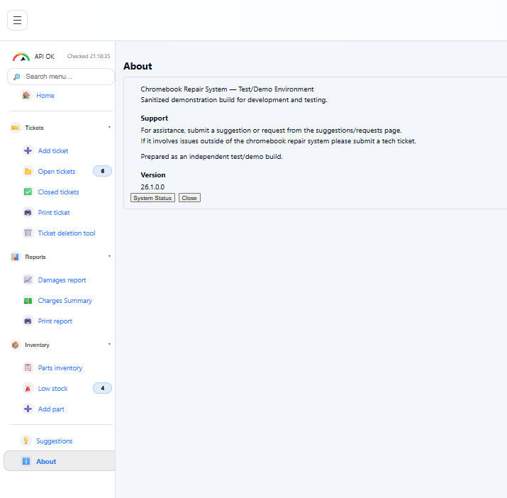
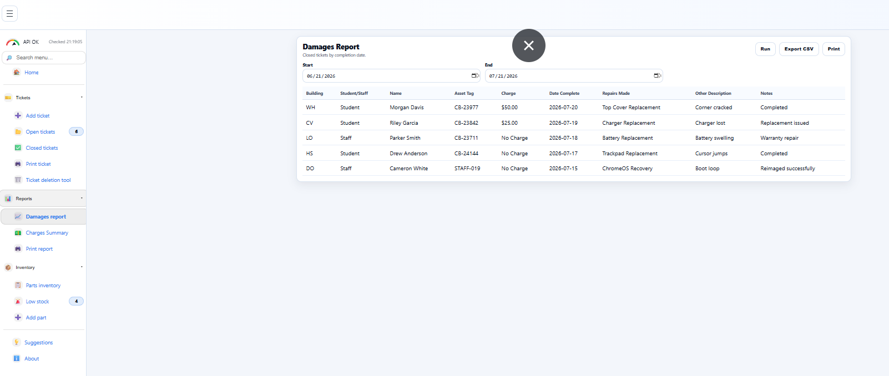
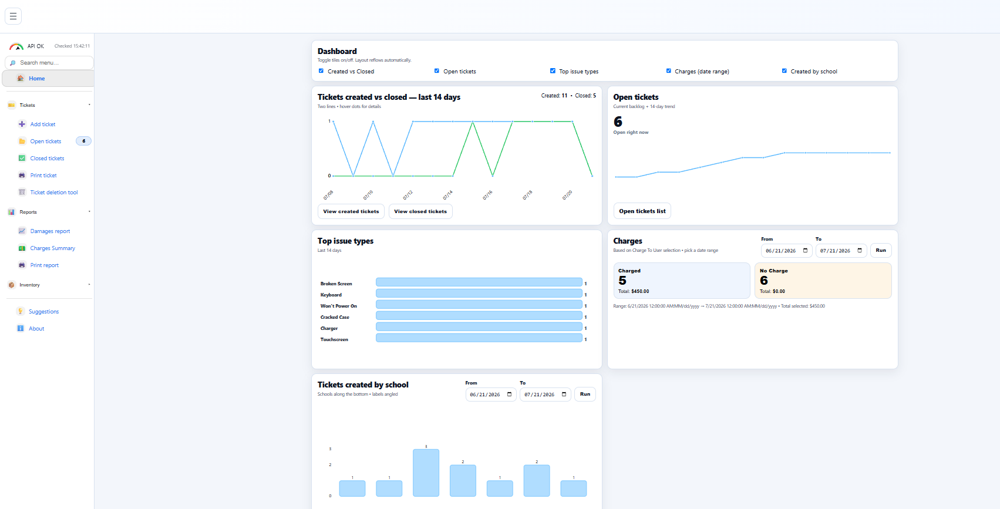
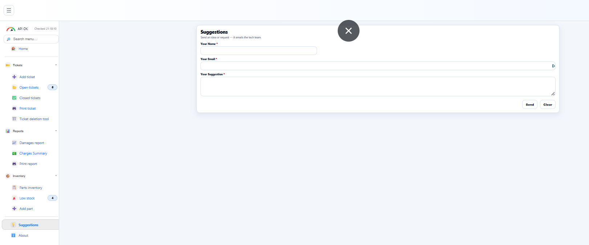

# Adam Thomas Portfolio

A hand-built professional portfolio site created with HTML, CSS, JavaScript, Git, and GitHub Pages.

## Pages

- Home
- About
- Projects
- Contact
- Resume

## Featured Project

### Chromebook Repair Management System

A web-based repair ticketing, inventory, reporting, and device-service management system built with:

- Blazor
- ASP.NET Core
- C#
- SQL Server
- Entity Framework Core
- REST APIs
- IIS
- Git and GitHub

Repository:

https://github.com/sneaky1/chromebook-repair-system

## Local Preview

Open `index.html` in a browser.

## Contact

Email: adam.thomas9891@gmail.com

GitHub: https://github.com/sneaky1

## Application Screenshots

### About

### Add Part

### Api Part 1

### Api Part 2

### Api Part 3

### Api Part 4

### Charges Summary

### Closed Tickets

### Damages

### Dashboard

### Edit Ticket

### Hover Ticket

### Low Stock

### New Ticket

### Open Tickets

### Parts Inventory

### Print Report Damages

### Print Ticket

### Suggestion

### Ticket Deletion

